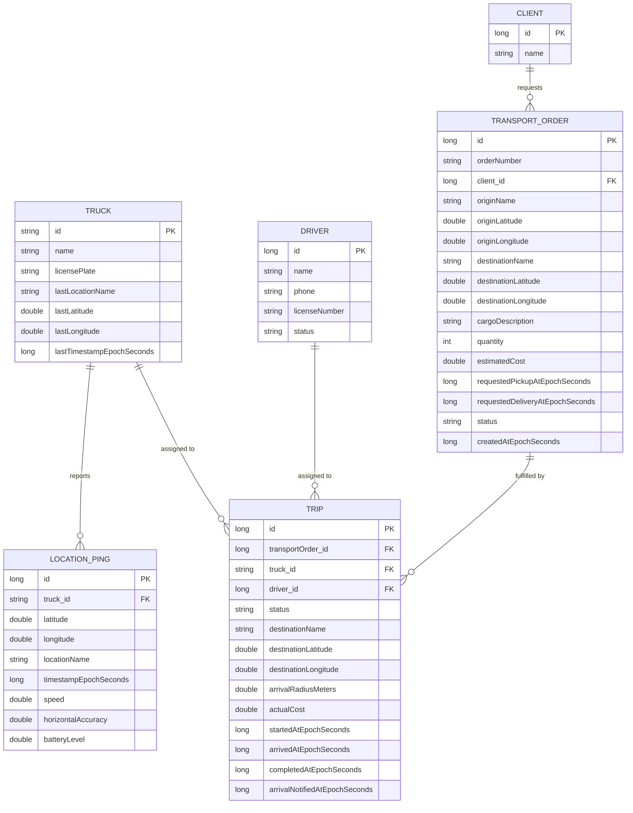

# Transport Manage

A backend for a trucking/transportation company (built with SHTL in mind) that:

1. Tracks live GPS location of trucks (fed from the [Overland](https://overland.p3k.app/) iOS app) and reverse-geocodes each point into a human-readable place name.
2. Manages **transport orders** (a customer's request to move cargo from A to B).
3. Manages **trips** (assigning a truck + driver to an order) and automatically detects when a truck has arrived at its destination, sending an email notification.

---

## Tech stack

- **Java 17**, **Spring Boot 4.1**
- **Spring Data JPA** / Hibernate, **PostgreSQL** (Neon) in prod, **H2** available for local/dev
- **Spring Mail** for arrival notification emails
- **Spring Validation** (`jakarta.validation`) on request DTOs
- **Lombok** for boilerplate getters/setters
- [`spring-dotenv`](https://github.com/paulschwarz/spring-dotenv) — loads a local `.env` file into Spring's environment (so secrets don't need to be exported manually)
- `spring.jpa.hibernate.ddl-auto=update` — Hibernate creates/updates tables from the `@Entity` classes automatically; there are no separate SQL migrations yet

---

## Data model



### Why `TransportOrder` and `Trip` are separate tables

- **`Client`** is just who the order is for (`id`, `name`) — kept as its own table (rather than a free-text field on the order) so the same client can be reused across many orders and looked up/reported on independently.
- **`TransportOrder`** is the customer-facing ask: "move this cargo from A to B by such-and-such date." It's created once and its history should survive even if things go wrong operationally.
- **`Trip`** is the operational assignment: which truck, which driver, and its live status. If a truck breaks down mid-delivery, the order doesn't have to be recreated — a new `Trip` can be created for the same order.
- `Trip.destinationLatitude` / `Trip.destinationLongitude` are **copied from the order at assignment time** (see `TripService.createTrip`). This is deliberate: the arrival check runs on *every single GPS ping*, so it reads the destination straight off the `Trip` row instead of joining back to `transport_orders` each time.

### Status lifecycles

```
TransportOrder:  PENDING → ASSIGNED → IN_TRANSIT → DELIVERED
                     ↑___________________________________|  (CANCELLED trip puts it back to PENDING)

Trip:            PLANNED → EN_ROUTE → ARRIVED → COMPLETED
                                                 (or CANCELLED from PLANNED/EN_ROUTE)

Driver:          AVAILABLE ⇄ ON_TRIP
```

---

## How it works end to end

### 1. Location tracking (already existed, unchanged)

- The Overland app on a driver's phone POSTs GPS batches to `POST /api/trucks/{truckId}/locations`.
- `LocationController` → `LocationService.ingest(...)`:
  - Auto-creates the `Truck` row if it doesn't exist yet (handy for a POC; in production trucks should be pre-registered).
  - Saves each point as a `LocationPing`.
  - Calls `GeocodingService` (OpenStreetMap Nominatim, free, no API key) to reverse-geocode the point into a short "City, State" name.
  - Updates the `Truck`'s cached `lastLatitude` / `lastLongitude` / `lastTimestampEpochSeconds` with the freshest point in the batch.

### 2. Registering a client, then creating a transport order

```
POST /api/clients
{ "name": "Acme Corp" }
```

```
POST /api/orders
{
  "orderNumber": "ORD-1001",
  "clientId": 1,
  "originName": "Los Angeles, CA",
  "originLatitude": 34.0522,
  "originLongitude": -118.2437,
  "destinationName": "Phoenix, AZ",
  "destinationLatitude": 33.4484,
  "destinationLongitude": -112.0740,
  "cargoDescription": "20 pallets of electronics",
  "quantity": 20,
  "estimatedCost": 1450.00,
  "requestedPickupAt": "2026-08-25T10:00:00Z",
  "requestedDeliveryAt": "2026-08-26T18:00:00Z"
}
```

Creates a `TransportOrder` with status `PENDING`.

### 3. Registering a driver

```
POST /api/drivers
{ "name": "John Doe", "phone": "555-1234", "licenseNumber": "D1234567" }
```

### 4. Assigning a truck + driver to the order (creating a Trip)

```
POST /api/trips
{ "transportOrderId": 1, "truckId": "truck-101", "driverId": 1 }
```

`TripService.createTrip`:
- Requires the order to be `PENDING` and the driver to be `AVAILABLE` (otherwise returns `400` with an explanation).
- Copies `destinationName` / `destinationLatitude` / `destinationLongitude` from the order onto the new `Trip`.
- Flips the order to `ASSIGNED` and the driver to `ON_TRIP`.
- Creates the `Trip` with status `PLANNED`.

### 5. Starting the trip (dispatch)

```
POST /api/trips/{id}/start
```

Flips `Trip` → `EN_ROUTE`, order → `IN_TRANSIT`, stamps `startedAtEpochSeconds`.

### 6. Automatic arrival detection

This is the new piece wired into the existing ingestion pipeline. Every time `LocationService.ingest()` processes a ping that's the **freshest** one for that truck, it now also calls:

```java
tripService.checkArrival(truck, latitude, longitude);
```

`TripService.checkArrival`:
1. Looks up the truck's currently `EN_ROUTE` trip (a truck should only ever have one at a time — `TripRepository.findFirstByTruckIdAndStatus`).
2. Computes the great-circle (haversine) distance from the new ping to `trip.destinationLatitude/Longitude` — using the shared `util/GeoUtils.haversineDistanceMeters` helper (also used by `LocationService` for its "has this truck moved enough to re-geocode" check).
3. If the distance is within the geofence radius — `trip.arrivalRadiusMeters` if set on the trip, otherwise the app-wide default `app.trip.default-arrival-radius-meters` (300m) — the trip is marked `ARRIVED`, `arrivedAtEpochSeconds` is stamped, and a notification is fired.
4. `arrivalNotifiedAtEpochSeconds` is then set, which prevents the notification from ever firing twice for the same trip (the geofence check keeps running on later pings, but this guard is checked before sending).

### 7. Notification

`NotificationService` is a small interface (`sendTripArrivalNotification(Trip trip)`), implemented today by `EmailNotificationService`:
- Sends a plain-text email to a single configured **dispatcher address** (`app.notifications.dispatcher-email`, see Configuration below) — not to the customer.
- If SMTP isn't configured or the send fails for any reason, the error is logged and swallowed — it will **never** break location ingestion or leave a trip stuck.

### 8. Completing (or cancelling) the trip

```
POST /api/trips/{id}/complete   → Trip: COMPLETED, Order: DELIVERED, Driver: AVAILABLE
{ "actualCost": 1380.50 }       (optional body -- fuel/tolls/driver pay once known)

POST /api/trips/{id}/cancel     → Trip: CANCELLED, Order: back to PENDING, Driver: AVAILABLE
```

`complete` requires the trip to already be `ARRIVED` (i.e. the geofence must have tripped first, or you're confirming a delivery ops already knows happened).

---

## API reference

### Trucks & locations (`/api/trucks`)

| Method | Path | Description |
|---|---|---|
| POST | `/api/trucks` | Pre-register a truck (`id`, `name`, `licensePlate`) before it's sent any GPS pings |
| GET | `/api/trucks` | List all trucks, incl. cached last-known position |
| POST | `/api/trucks/{truckId}/locations` | Overland's configured "Server URL" — ingests a batch of GPS points (auto-creates the truck if `POST /api/trucks` was never called for it) |
| GET | `/api/trucks/{truckId}/locations` | Full location history for a truck, newest first |
| GET | `/api/trucks/{truckId}` | Truck details incl. cached last-known position |
| GET | `/api/trucks/available` | Trucks eligible for a given order, nearest-first, excluding ones on an active trip |

### Clients (`/api/clients`)

| Method | Path | Description |
|---|---|---|
| POST | `/api/clients` | Create a client |
| GET | `/api/clients` | List all clients |
| GET | `/api/clients/{id}` | Get one client |

### Drivers (`/api/drivers`)

| Method | Path | Description |
|---|---|---|
| POST | `/api/drivers` | Create a driver |
| GET | `/api/drivers` | List all drivers |
| GET | `/api/drivers/{id}` | Get one driver |

### Transport orders (`/api/orders`)

| Method | Path | Description |
|---|---|---|
| POST | `/api/orders` | Create an order (status `PENDING`) |
| GET | `/api/orders` | List all orders |
| GET | `/api/orders/{id}` | Get one order |

### Trips (`/api/trips`)

| Method | Path | Description |
|---|---|---|
| POST | `/api/trips` | Assign a truck + driver to a transport order |
| POST | `/api/trips/{id}/start` | Dispatch: `PLANNED` → `EN_ROUTE` |
| POST | `/api/trips/{id}/complete` | Confirm delivery: `ARRIVED` → `COMPLETED` |
| POST | `/api/trips/{id}/cancel` | Abort a trip |
| GET | `/api/trips` | List all trips |
| GET | `/api/trips/{id}` | Get one trip |
| GET | `/api/trips/by-truck/{truckId}` | Trip history for a truck, newest first |

All `POST`/state-transition endpoints on `/api/trips` return `400 { "error": "..." }` on invalid state transitions (e.g. starting a trip that's already `EN_ROUTE`, assigning a driver who isn't `AVAILABLE`), and `POST /api/orders` returns the same `400` shape if `clientId` doesn't exist.

### Interactive API docs

[springdoc-openapi](https://springdoc.org/) generates a FastAPI-`/docs`-style page automatically from the controllers above:

- Swagger UI: `http://localhost:8080/docs`
- Raw OpenAPI JSON: `http://localhost:8080/api-docs`

---

## Configuration

### `.env` (loaded automatically via `spring-dotenv`)

```dotenv
# Neon Postgres connection
SPRING_DATASOURCE_URL=jdbc:postgresql://...
SPRING_DATASOURCE_USERNAME=...
SPRING_DATASOURCE_PASSWORD=...

# Trip arrival notifications -- fill in once an SMTP provider is chosen
DISPATCHER_EMAIL=ops@yourcompany.com
SMTP_HOST=smtp.yourprovider.com
SMTP_PORT=587
SMTP_USERNAME=...
SMTP_PASSWORD=...
```

Until `DISPATCHER_EMAIL` / SMTP vars are filled in, trip arrival still works correctly (status flips to `ARRIVED`) — only the email send is skipped and logged as a warning/error.

### `application.properties` — relevant additions

```properties
# Radius (meters) a truck must be within its trip's destination to count as "arrived"
app.trip.default-arrival-radius-meters=300

app.notifications.dispatcher-email=${DISPATCHER_EMAIL:}

spring.mail.host=${SMTP_HOST:}
spring.mail.port=${SMTP_PORT:587}
spring.mail.username=${SMTP_USERNAME:}
spring.mail.password=${SMTP_PASSWORD:}
```

---

## Running locally

```bash
./mvnw spring-boot:run
```

The server binds to `0.0.0.0:8080` so a phone on the same network can reach it (needed for the Overland app to POST location updates).

Run tests:

```bash
./mvnw test
```

---

## Known limitations / possible next steps

- **No auth** — every endpoint is open. Fine for a POC, not for production.
- **Single dispatcher recipient** — arrival emails go to one configured address, not per-client contacts. Easy to extend (`Client` would need an `email` field).
- **Single-leg trips only** — one origin → one destination. Multi-stop routes would need a `TripStop` table and a walk-through-stops version of `checkArrival`.
- **One active (`EN_ROUTE`) trip per truck is assumed**, not enforced by a DB constraint — `TripRepository.findFirstByTruckIdAndStatus` just takes the first match.
- **`ddl-auto=update`** is convenient for a POC but not safe for a real production migration story — consider Flyway/Liquibase before this goes live.
- Trucks are still **auto-created on first GPS ping** (`LocationService.ingest`) — remove that convenience once trucks are meant to be pre-registered via a real fleet-management flow.